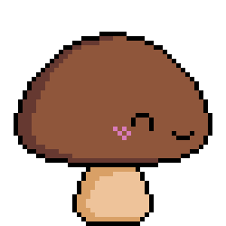

# mushy



A lightweight, daemonized terminal pet that walks along the inner borders of your terminal using the Kitty Graphics Protocol.

> **Note:** This project is a shitpost/meme and not a serious project.

## Requirements
- A terminal emulator with **Kitty Graphics Protocol** support (e.g. WezTerm, Kitty, Ghostty).

## Features
- **Multi-Pet Support**: Spawn as many pets as you want in the same terminal! They use completely independent PIDs and uniquely randomized Z-indexes to overlap without graphics tearing.
- **Randomized Spawns**: Pets calculate a pseudo-random perimeter offset when they spawn so they don't start on top of each other.
- **Terminal-Aware Lifecycle**: Pets are intrinsically bound to the specific terminal pane (`tty`) they were launched in.
- **Self-Contained**: The default `mushroom.gif` is compiled directly into the binary! You don't need any external assets to run it.

## How it works

When you launch `mushy`, it immediately forks itself into the background as a detached daemon using `setsid` so it doesn't block your terminal prompt. 

On startup, it decodes your GIF and pre-renders every frame into memory for all 4 rotational directions. It then enters a render loop, calculating its position along the perimeter of the specific terminal window it was launched in. Every 50 milliseconds, it pipes the next frame of the animation as a raw base64 payload to the terminal's standard output using the Kitty Graphics Protocol, utilizing double-buffering and exact Z-indexes to prevent flickering or graphical tearing.

## Installation

To install `mushy` globally to your system's Cargo path (`~/.cargo/bin`), simply run:
```bash
just install
# or
cargo install --path .
```

## Usage

Once installed, you can spawn the default mushroom pet simply by running:

```bash
mushy
```
*(Note: During development, you can substitute `mushy` with `cargo run --` or use the provided `just test-*` recipes).*

Start the walker and override the configuration using CLI arguments:
```bash
# Provide a custom GIF
mushy --gif ./walking_pollo.gif

# Change the target size and rotate clockwise
mushy --size 60 --cw

# Change the physical movement speed (does not affect the leg animation rate!)
mushy --speed 2.5

# Provide a custom config file
mushy --config ./my_config.toml
```

Stop the daemon in the **current terminal pane** and clear the screen:
```bash
mushy stop
```

Stop **all** running instances across all terminal windows globally:
```bash
mushy stop --all
# or
just stop
```

> **Note:** If you close a terminal window manually, its associated background pets will automatically detect the closure, terminate themselves gracefully, and clean up their graphics from memory!

## Limitations & Performance

Because `mushy` relies on the Kitty Graphics Protocol to constantly pipe base64-encoded image chunks over the terminal's standard output (TTY) every 50 milliseconds, there are two practical limits to be aware of:
- **Excessive Target Sizes (`--size`):** Passing a huge size like `--size 500` will cause the daemon to blast megabytes of base64 text into the terminal buffer every single frame. This will instantly bottleneck your terminal's PTY throughput, causing extreme lag and input stuttering. Keep the size reasonable (e.g. `20` to `150`).
- **Very Long GIFs:** When spawning a new pet, `mushy` intercepts the GIF, extracts every frame, downscales it, rotates it in 4 directions, and pre-encodes the entire sequence into memory. Loading a GIF with hundreds of frames will cause a noticeable delay before the pet appears and will consume a lot of RAM.

## Known Issues

- **Wezterm Alternate Screen Buffer Bug:** If you run an application that uses the Alternate Screen Buffer (like `btop`, `hx`, or `vim`) while pets are running, Wezterm may orphan the last rendered frame of the pet, leaving behind a frozen "ghost" sticker when you exit the app. This is a known issue with Wezterm's implementation of the Kitty protocol's `delete` command on inactive buffers. To clear the ghost, simply press `Ctrl+L` (or run `clear`) to force the terminal to redraw its grid.

## CLI Arguments

- `-g, --gif <PATH>`: Path to the GIF you want to animate.
- `-s, --size <SIZE>`: The size to scale the GIF bounding box to (in pixels).
- `-x, --speed <SPEED>`: Multiplier for the physical movement speed along the terminal borders. This affects how fast the pet traverses the screen, independently of the GIF's animation frame rate.
- `--cw`: Rotate the GIF clockwise instead of counter-clockwise.
- `-c, --config <PATH>`: Path to a custom `config.toml` file.

## Configuration

The configuration is handled via a TOML file. It will look for a config file in your XDG Config directory (`~/.config/mushy/config.toml`) or a custom path passed via `--config`. 

If a config file is not found, it gracefully falls back to default settings and uses the **built-in `mushroom.gif`**! This means you can run the executable anywhere.

Example `config.toml`:

```toml
# Path to the GIF you want to animate (absolute or relative)
# If left out or invalid, falls back to the embedded mushroom!
gif_path = "./walking_pollo.gif"

# Walk direction. False = Counter-Clockwise, True = Clockwise
rotate_clockwise = false

# The size to scale the GIF bounding box to (in pixels)
target_size = 40

# Speed multiplier (1.0 is normal)
speed = 1.0
```

## AI Usage

The code for this project was entirely generated by an AI assistant (Gemini 3.1 Pro in antigravity-cli) based on user prompts.
